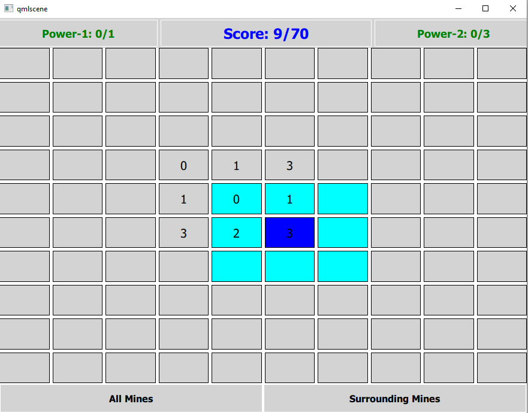

# MineSweeper
MineSweeper Game with cheatsheet.

Inspired from this video from [onelinecode.com](https://www.youtube.com/watch?v=FOIbK4bJKS8), i developed this game in QML.

To run the QML file, you need to have Qt Installed on your system.

```shell
$ qmlscene MineSweeper.qml 
```



`wx-cpp` contains implementation of MineSweeper using C++ and wxWidgets. 